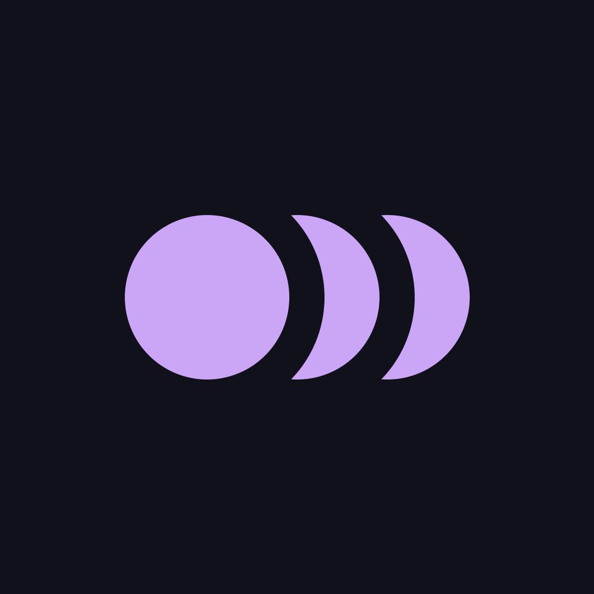
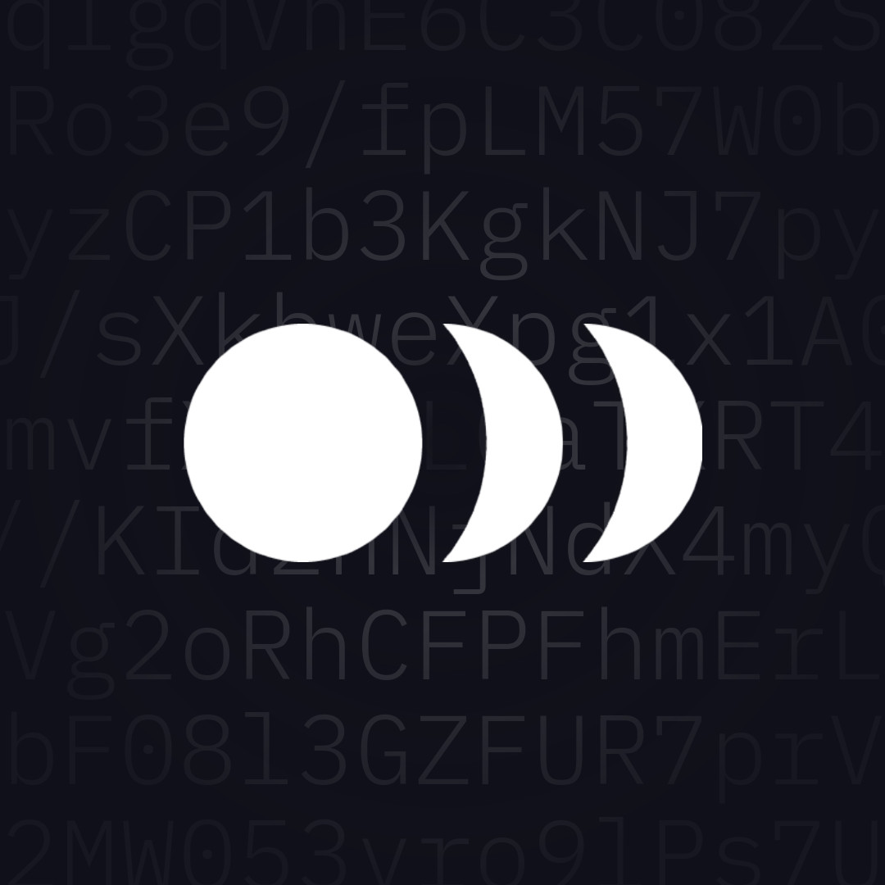
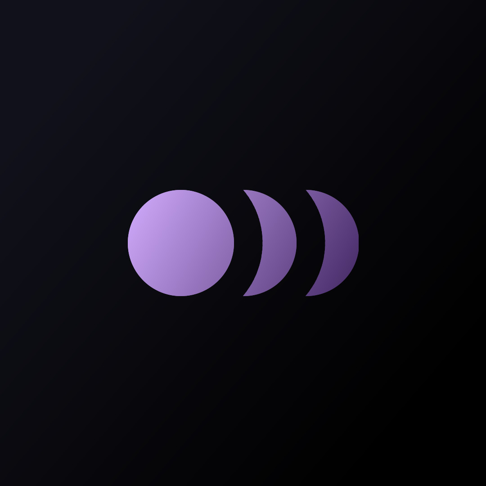
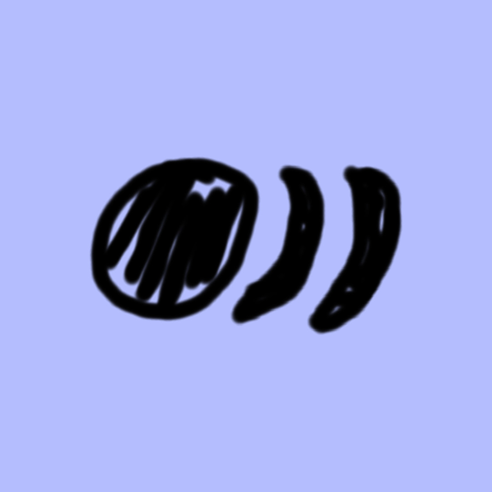
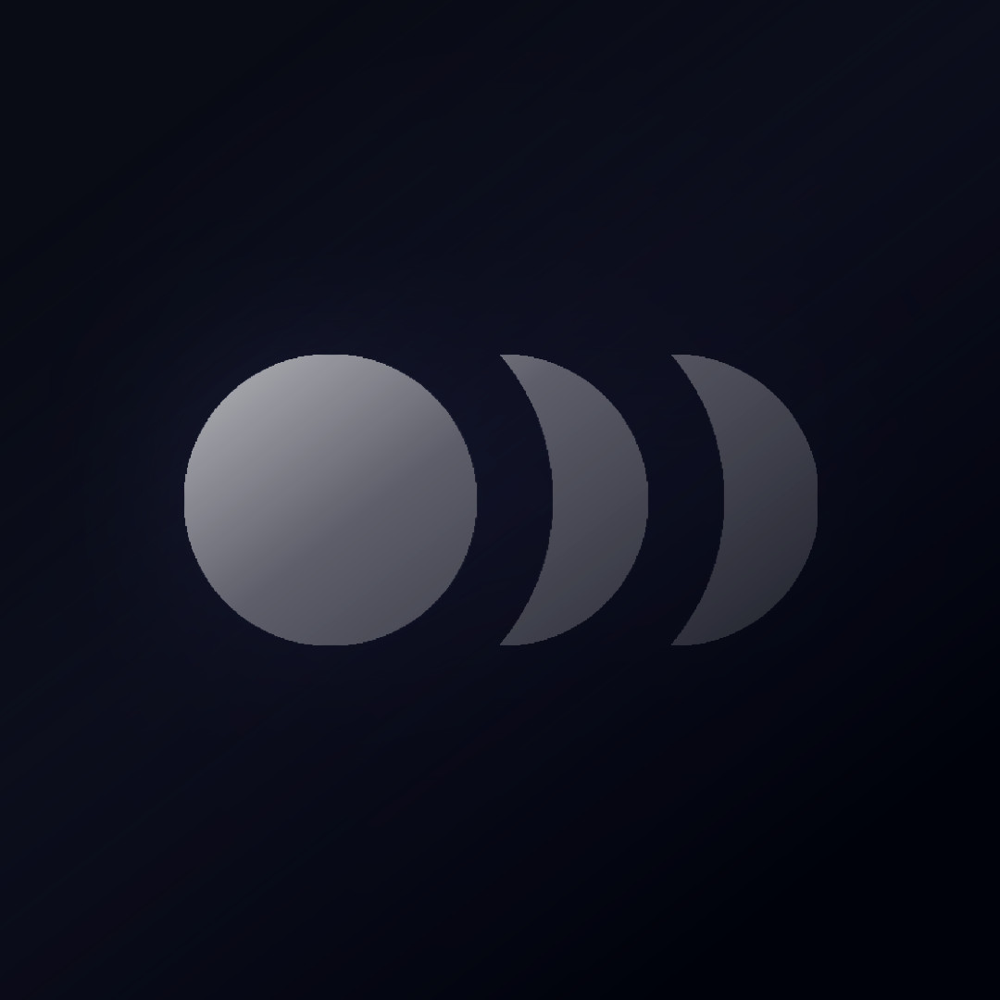
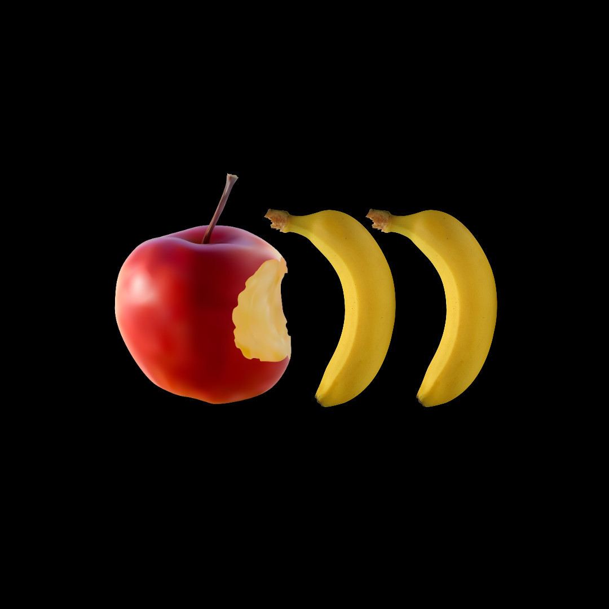
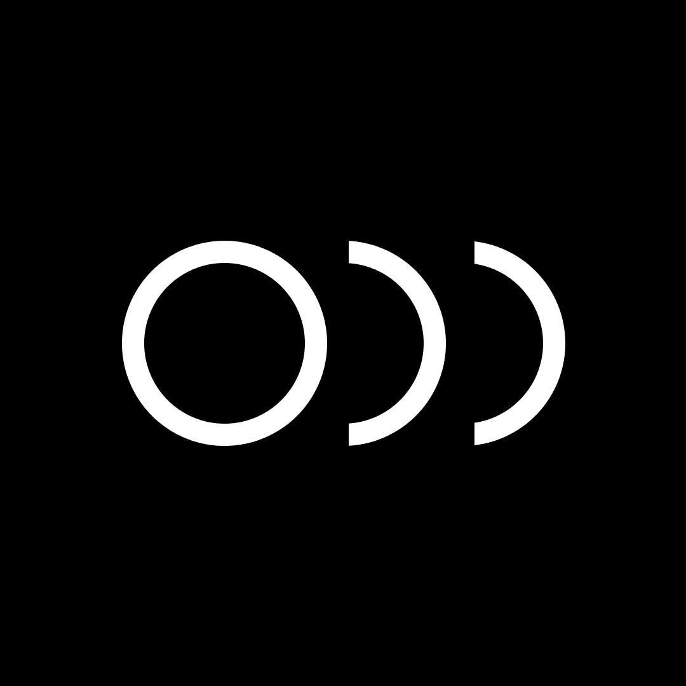
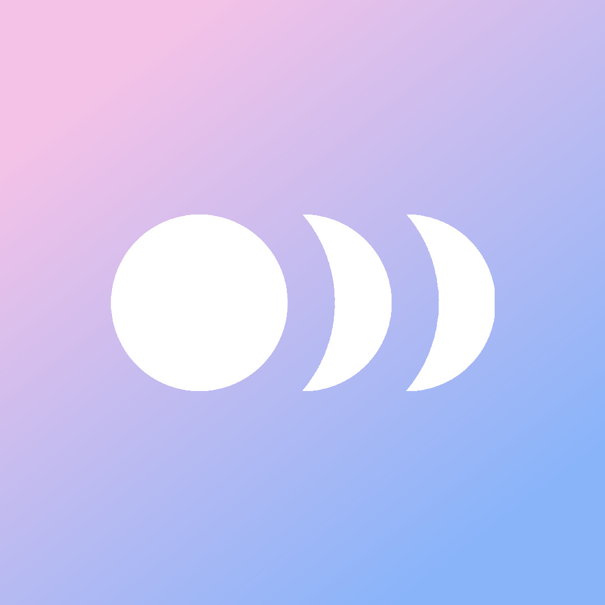
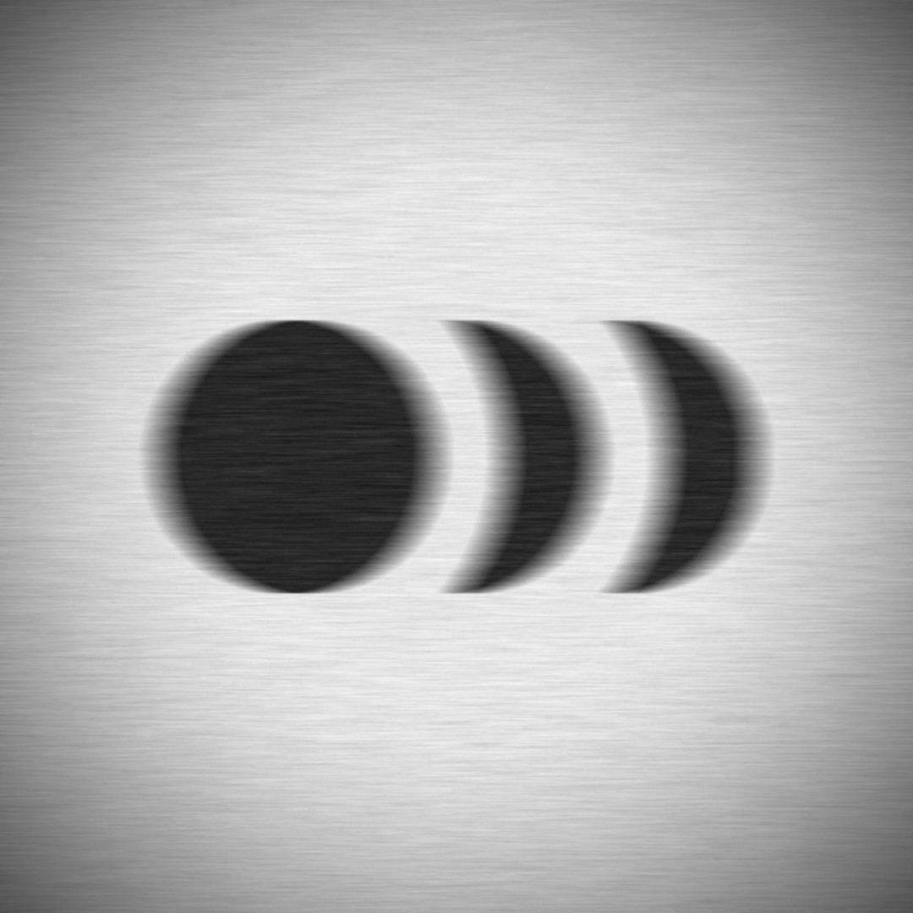

<h3 align="center">
  <code><a href="https://prpl.wtf">Emma</a>'s Circles</code>
</h3>
 

| Variation | Description |
|-----------|-------------|
|  | [`emma-base.jpg`](./emma-base.jpg)   The original circles variation, inspired by the [Catppuccin](https://catppuccin.com) color palette. |
|  | [`emma-chars.jpg`](./emma-chars.jpg)   A more modernized version of the circles logo, more intended for medium-sized profile pictures. The "random" characters in the background are portions of `orbit`s public key. |
|  | [`emma-cinematic.jpg`](./emma-cinematic.jpg)   Dramatic version of the base variation. Hasn't been used anywhere, but has a nice touch to it. |
|  | [`emma-dots.jpg`](./emma-dots.jpg)   Originally made (and used) for a small screen on my doorbell. Very low quality, but oh well, so is the screen on that doorbell. One of my favorite variations. |
|  | [`emma-drawing.jpg`](./emma-drawing.jpg)   Took me so many tries to get right. Made with my laptop's touchpad and looks horrible, I love it. As of right now (19-02-2025), the drawing is used for [my website](https://prpl.wtf)'s favicon. |
|  | [`emma-faded.jpg`](./emma-faded.jpg)   Made this while feeling sad, hence the darker and more faded colors. I slightly dislike this variation due to the reason behind it's creation, but it's usable I guess. |
|  | [`emma-fruit.jpg`](./emma-fruit.jpg)   Felt silly. Made with random stock photos from the interwebs. Considered putting this together with fake PNGs, but that was way too cursed. |
|  | [`emma-lines.jpg`](./emma-lines.jpg)   If I were a security company my logo would probably be this. There are some slight issues with the design, might fix it sometime. |
|  | [`emma-pastel.jpg`](./emma-pastel.jpg)   Guess what the colors stand for, I'll give you a hint: 🏳️‍⚧️. Resembles a substantial part of my identity through subtle colors in a profile picture. Pastel colors borrowed like usual from [Catppuccin](https://catppuccin.com). |
|  | [`emma-pyro.jpg`](./emma-pyro.jpg)   Variation using the (old) pre-rinth color scheme of [Pyro Inc.](https://pyro.host). |
|  | [`emma-vignette.jpg`](./emma-vignette.jpg)   Blurry, noisy and generally eerie variation. You don't want to see this next to your bed while half asleep, trust me. |

 

<a property="dct:title" rel="cc:attributionURL" href="https://github.com/prplwtf/circles">Emma's Circles</a> by <a rel="cc:attributionURL dct:creator" property="cc:attributionName" href="https://prpl.wtf">Emma (prpl.wtf)</a> is licensed under <a href="https://creativecommons.org/licenses/by-nc-sa/4.0/?ref=chooser-v1" target="_blank" rel="license noopener noreferrer" style="display:inline-block;">Creative Commons Attribution-NonCommercial-ShareAlike 4.0 International</a>
 
